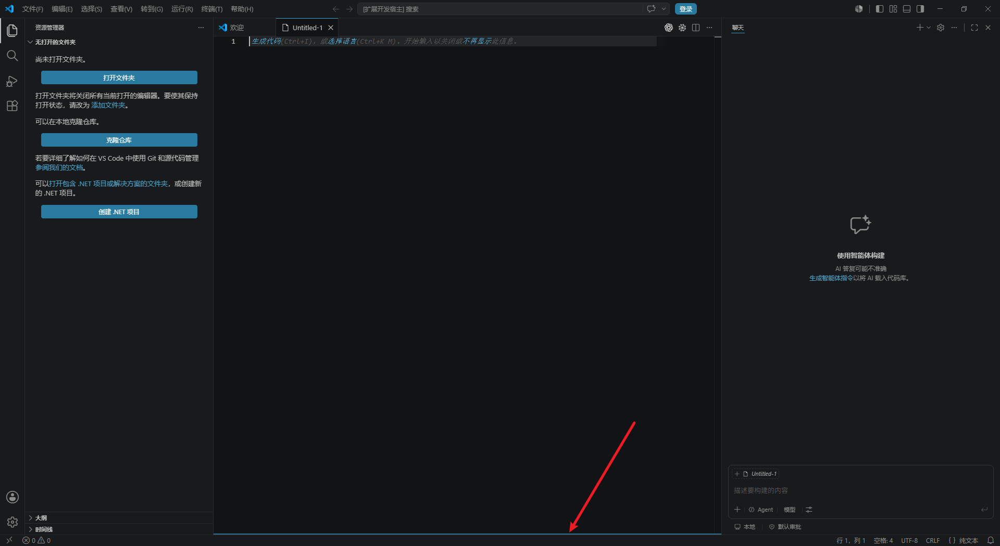
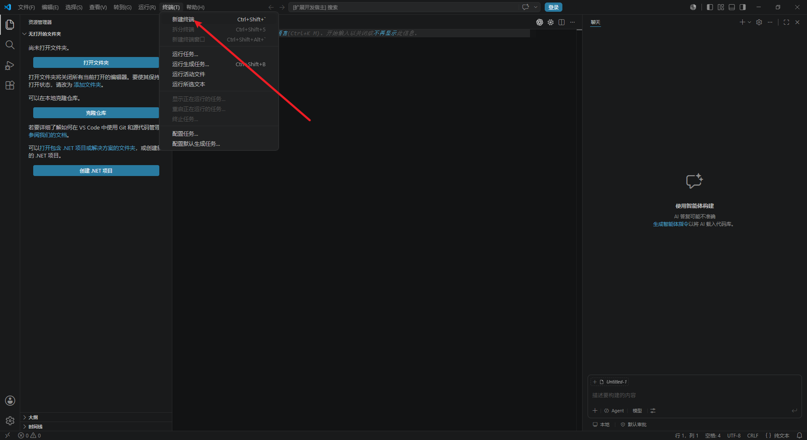
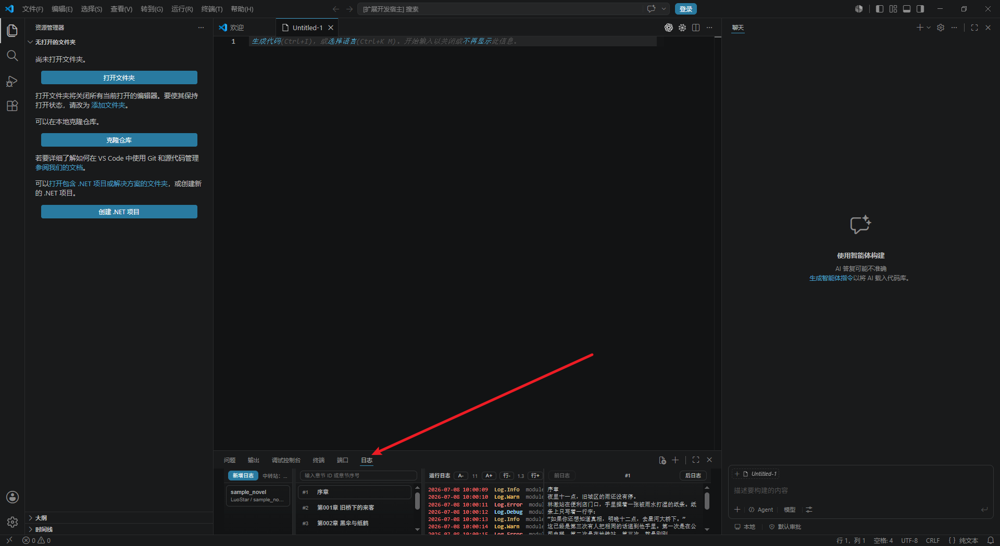

# Reader

`Reader` 是一个在 VS Code 底部面板中阅读 `txt` 书籍的扩展，适合在写代码时顺手阅读小说或长文本内容。
github仓库地址：https://github.com/LuoStar1024/Reader-VSCode

第一次打开时，如果底部面板没有展开，可以使用下面两种方式把界面拉出来。

方式 1：鼠标放到编辑区和底部区域的分隔位置，当鼠标变成上下拖拽的箭头图标时，向上拖拽，拉出界面。

方式 2：点击 `终端 -> 新建终端`，拉出底部界面。

打开后，切换到“日志”项，可以看到整个阅读界面一共分为 4 个区域：

1. 第一个区域用于添加 `txt` 书籍。
2. 第二个区域用于章节调整和章节列表，点击对应章节后，正文会切换。
3. 第三个区域是日志模拟区域，同时可以调整字体大小和行距。
4. 第四个区域是正文部分，同时提供上一章和下一章按钮。

当前扩展支持：

- 导入一个或多个 `txt` 文件
- 自动识别常见章节标题
- 点击章节切换正文
- 记忆阅读进度
- 记忆面板布局、字体大小和行距

## License

This project is licensed under the GNU GPL v3. See the [LICENSE](LICENSE) file for details.

## 广告

本项目全程使用ai开发完成，使用的中转站：https://ai.luostar.net 或者cf代理的 https://aicf.luostar.net
